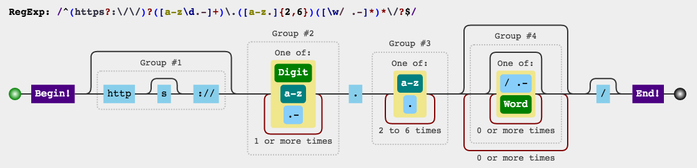
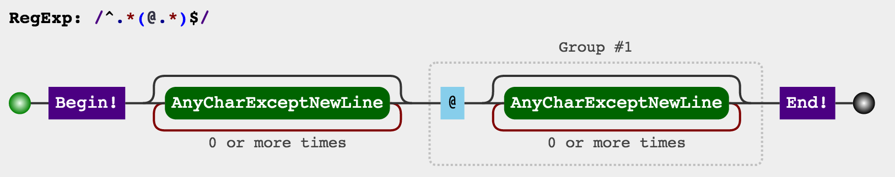

"Some people, when confronted with a problem, think “I know, I'll use regular expressions.”  Now they have two problems."
— James Zawinski, [alt.religion.emacs, 1997](http://regex.info/blog/2006-09-15/247)

A regular expression (abbreviated regexp or regex) is a way to describe sets of characters strings using a token-based language, or syntax. We can use them to test strings to see if they match the pattern, find where patterns begin, and even search and replace parts of matching strings with other strings.

## Learning Regular Expressions

Learning to read and write Regex is a journey of its own. In my opinion, [RegexOne](http://regexone.com/) is the best resource to learn the basics of the regular expression syntax.

This regex `/cat/` matches any string that contains this pattern:

> the character 'c' followed directly by the character 'a' followed directly by the character 't'.

Regexes can do much more than this. You can check for any character (`.at` => 'cat', 'hat', 'bat', 'mat'), one character of a set (`[chb]at` => 'cat', 'hat', 'bat' but not 'mat'), optional characters (`c?at` => 'cat' or 'at'), and much more.

Simple regular expressions are easy to understand, but complex Regular Expressions look like character soup, until you realise that you don't read them in words, but character by character.

This regular expression matches strings that are valid URLs:

`^(https?:\/\/)?([\da-z\.-]+)\.([a-z\.]{2,6})([\/\w \.-]*)*\/?$`

To be able to understand how regular expressions are interpreted by the computer, I like using a regex visualiser to show a regular expression as a *railroad diagram*.



* [RegexOne: Learn to use Regular Expressions](http://regexone.com)
* [Regulex: Visualise regular expressions as railroad diagrams](http://jex.im/regulex/)
* [Visibone: Regular Expressions quick reference](http://www.visibone.com/regular-expressions/)

## Declaring Regular Expressions

```js
var catPattern = /cat/;
```

Regular Expressions are JavaScript objects. They can be created literally by including your regex pattern inside a pair of forwardslashes `/`. You can also declare them with `new RegExp("cat")`, but there are sometimes problems encoding regular expression patterns as strings. You get the same thing either way.

## Testing for a match

* `RegExp.test( inputString )``

The `test` method returns `true` if the pattern will match with the string, and `false` if it does not.

```js
var catPattern = /cat/;
// match any 'c', followed by an 'a', followed by a 't'.

// do these strings match with this regex?
console.log( catPattern.test("dog") ); // false
console.log( catPattern.test("mouse") ); // false
console.log( catPattern.test("cat") ); // true
console.log( catPattern.test("cats") ); // true
console.log( catPattern.test("bobcat") ); // true
console.log( catPattern.test("delicate") ); // true
console.log( catPattern.test("unscathed") ); // true
```

## Searching for a match

* `String.search( inputRegExp )`

This method lives on string values, not regular expressions. The `search` method will search for matches of the input regex pattern within the string. It will return the index of the first occurrence of a match, or `-1` if there is no match.

```js
var ourPattern = /our/

console.log( "hour".search(ourPattern) ); // 1
console.log( "armoured".search(ourPattern) ); // 6
console.log( "our source".search(ourPattern) ); // 0
console.log( "banana".search(ourPattern) ); // false
```

## Replacing matches with new values

* `String.replace( inputRegExp, newString )`

This string method will search for a match and replace it with the new string.

```js
console.log( "recieve".replace( /ie/, "ei") ); // "receive"
console.log( "recieve recieve".replace( /ie/, "ei") ); // "receive recieve" -- only the first is replaced
console.log( "recieve recieve".replace( /ie/g, "ei") ); // "receive receive" -- g flag will replace 'globally'
```

`replace()` can also make use of subexpressions within regular expressions:



```js
var simpleEmailPattern = /^.*(@.*)$/; // a whole string with any number of any chara

console.log( "bob@example.com".replace(simpleEmailPattern, "brett$1") ); // brett@example.com
```

There is a lot the `replace` method can do. [Check the MDN documentation](https://developer.mozilla.org/en-US/docs/Web/JavaScript/Reference/Global_Objects/String/replace) and discover how powerful it is.


## Must Know Regular Expressions

Here are several regular expressions you'll find useful.

* `/^[a-z0-9_-]{3,16}$/` -- Match a Username between 3 and 16 chars long
* `/^.{6,}$/` -- Match a password
* `/^#?([a-f0-9]{6}|[a-f0-9]{3})$/` -- Match a hexadecimal CSS colour code
* `/^[a-z0-9-]+$/` -- Match a slug: a pretty fragment of a URL
* `/([^\s]+(\.(?i)(jpg|png|gif|bmp))$)/` -- Match a filename based on extension
* `/^([a-z0-9_\.-\+]+)@([\da-z\.-]+)\.([a-z\.]{2,})$/` -- Match an email address
* `/(1[012]|[1-9]):[0-5][0-9](\\s)?(?i)(am|pm)/` -- Match a 12-hour time
* `/([01]?[0-9]|2[0-3]):[0-5][0-9]/` -- Match a 24-hour time.
* `/(0?[1-9]|[12][0-9]|3[01])/(0?[1-9]|1[012])/((19|20)\\d\\d)/` -- Match a date in dd/mm/yyyy format
* `/^(https?:\/\/)?([\da-z\.-]+)\.([a-z\.]{2,6})([\/\w \.-]*)*\/?$/` -- Match a URL, excluding query strings and anchors
* `/^(?:(?:25[0-5]|2[0-4][0-9]|[01]?[0-9][0-9]?)\.){3}(?:25[0-5]|2[0-4][0-9]|[01]?[0-9][0-9]?)$/` Match an IPv4 Address

And finally, [DO NOT attempt to parse HTML with Regular Expressions.](http://stackoverflow.com/questions/701166/can-you-provide-some-examples-of-why-it-is-hard-to-parse-xml-and-html-with-a-reg)  ***[EVER.](http://stackoverflow.com/questions/1732348/regex-match-open-tags-except-xhtml-self-contained-tags/1732454#1732454)***
